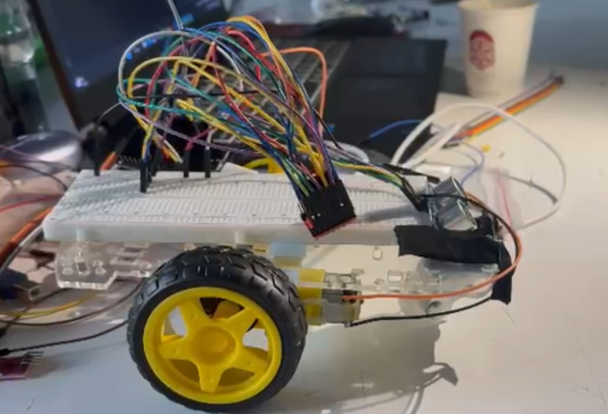

# 🤖 ESP32 Rover — Lab 7



ESP32 mikrodenetleyici tabanlı, WiFi üzerinden UDP soketi ile Python CLI'dan kontrol edilen akıllı rover projesi.

## 🔧 Donanım

| Bileşen | Detay |
|---------|-------|
| Mikrodenetleyici | ESP32 |
| Haberleşme | UDP / WiFi Socket |
| Mesafe Sensörü | HC-SR04 Ultrasonik |
| Servo Motor | Pin 3 (0°–180°) |
| Kontrol Arayüzü | Python CLI (PC) |

## 📁 Dosyalar

| Dosya | Açıklama |
|-------|----------|
| `rover/rover.ino` | ESP32 Arduino kodu (C++) |
| `rover.py` | PC tarafı kontrol scripti (Python) |
| `rover-1.mp4` | Demo video 1 |
| `rover-2.mp4` | Demo video 2 |
| `rover-3.mp4` | Demo video 3 |

## 🎮 Kontrol Komutları

```bash
python rover.py
```

| Komut | Açıklama |
|-------|----------|
| `forward` | İleri git |
| `backward` | Geri git |
| `left` | Sola dön |
| `right` | Sağa dön |
| `stop` | Dur |
| `quit` | Bağlantıyı kes |

## 🏫 Ders Bilgisi
**EE304 — Embedded Systems  |  Lab 7**

## 👩‍💻 Geliştirici
**Beyza Erdem** — 2211051049
